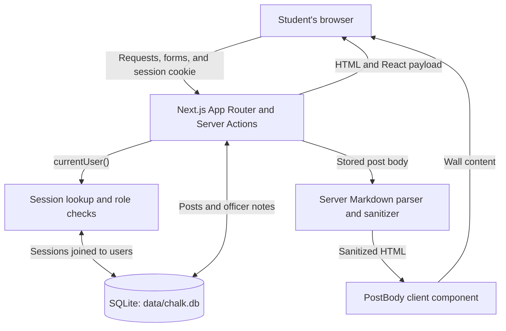

# Chalk architecture

- **Creating a post:** `app/compose/page.js` renders a form connected to `createPostAction` in `lib/actions.js`. Next.js submits the form to that Server Action. The action calls `currentUser()`, requires a signed-in user, checks that the body contains 3–2000 characters, inserts the body and user ID into SQLite with SQL placeholders, and redirects to `/`. There is no Express `POST /items` route in this app.

- **How the cookie becomes a user:** Login checks the password hash using bcrypt. `createSession(user.id)` generates a random 24-byte token, stores it with the user ID in `sessions`, and returns it. The action sets the `chalk_session` cookie. On a later request, `currentUser()` reads that cookie through Next.js `cookies()` and calls `userFromToken()`. That function joins `sessions` to `users` by the matching token and returns the user's ID, email, display name, and role, or `null`. The cookie is an opaque lookup token, not a JWT and not a copy of the user's role.

- **Authentication and ownership:** Creating and deleting posts require a session on the server. `deletePostAction` loads the selected post and checks that the requester is either its author or an officer before deleting it. Hiding the Take down button is only a UI convenience; the Server Action performs the authorization check.

- **Officer desk:** `app/mod/page.js` redirects signed-out visitors to `/login`. Members receive a restriction message and no private desk records. Only after checking `user.role === "officer"` does it read `officer_desk`. Officers also see the desk navigation link and may delete any post. The supplied code has a pinned database field, a seeded pinned post, and pinned-first ordering, but no implemented pin/unpin Server Action.

- **Wall rendering:** `app/page.js` reads posts joined to their authors and sorts pinned posts first. It calls `renderMarkdown(post.body)` on the server. Before the patch, the helper passed raw HTML through. After the patch, `markdown-it` treats raw HTML as text, and `sanitize-html` filters the resulting HTML to approved formatting tags, attributes, and URL schemes. The result becomes the `html` prop passed to `PostBody`.

- **Server versus browser:** Page components and the layout are Server Components. Database access, password checks, session lookups, authorization, and Markdown conversion run on the server. `PostBody` has `"use client"` and uses `dangerouslySetInnerHTML`; Client Components can still be prerendered into the initial server HTML and then hydrated in the browser. The browser interprets the final HTML, which is why unsafe post HTML can execute JavaScript there. `"use server"` keeps the Server Action implementations on the server.

- **Cookie hardening:** Both login and registration set `HttpOnly`, retain `SameSite=Lax`, and set `Secure` in production. `HttpOnly` prevents JavaScript from reading the cookie; it does not stop injected JavaScript from making requests as the signed-in visitor. Sanitizing the post-rendering path fixes the identified XSS.
