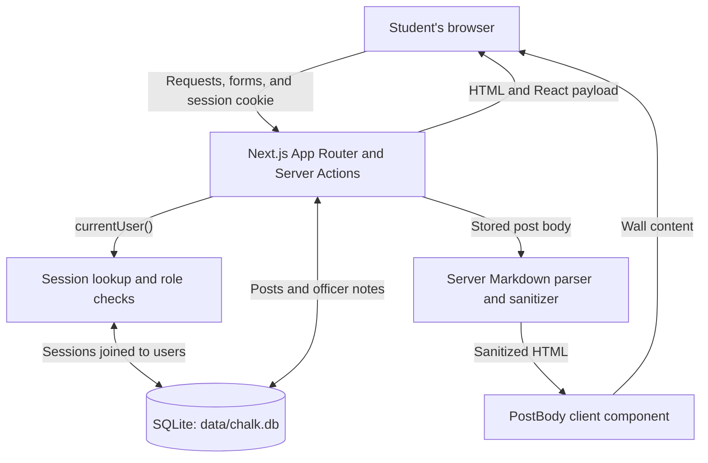

# Chalk architecture

- **Server and browser:** Next.js handles database access, sign-ins, and permission checks on the server. The browser displays the pages and submits forms.

- **Signing in and sessions:** After signing in, the browser receives a chalk_session cookie. The server uses it to find the signed-in user and their role; signing out removes the session and cookie.

- **Creating a post:** The compose form sends the post to createPostAction(), which checks that the user is signed in and the text meets the length requirements. It saves the post in SQLite and redirects to the wall.

- **Displaying posts and the XSS fix:** The wall loads saved posts and passes them through renderMarkdown(). The patched function keeps user-entered HTML as text and cleans the output before displaying it, while preserving normal Markdown formatting.

- **Removing a post:** Authors can remove their own posts, and officers can remove any post. The server checks these permissions before deleting anything.

- **Officer desk:** Only officers can view the private notes at /mod. Signed-out visitors are sent to login, while members see an access restriction message.

- **Database:** SQLite stores users, sessions, posts, and officer notes. The seed function adds demo content when no users exist and prevents multiple workers from creating duplicate accounts.
